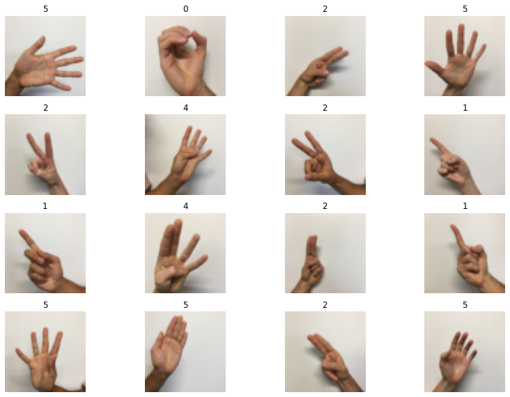

# Multi-Layer Perceptron for Image Classification

Welome to the **first** programming assignment of the Deep Learning course. 

In this assignment, a complete set of Jupyter Notebook and python scripts are prepared for examining almost all critical factors in designing a Multi-layer Perceptron model.

You will complete the python scripts which have been provided in the project directory to build a deep network, and apply it to a multi-label classification problem. Additionally you will play around varoius factors which may enhance the performance of a deep neural network model.

**After this assignment you will be able to:**

 - Build and apply a deep neural network to supervised learning using PyTorch framework.
 - See how factors like **Regularization techniques**, **Activation functions**, **Number of layers and units**, **Weights initialization** and **Data augmentation** affect the result of learning process.

 Alongside the `mlp.ipynb` notebook, there some python files with *TODO* sections filled with proper lines of code. For Each *TODO* section, a comprehensive description of the required code is provided.

## Dataset

Sign languages (also known as signed languages) are languages that use manual communication to convey meaning. This can include simultaneously employing hand gestures, movement, orientation of the fingers, arms or body, and facial expressions to convey a speaker's ideas. [Source.](https://en.wikipedia.org/wiki/Sign_language)

The dataset that you'll be using during this assignment is a subset of the sign language digits. It contains six different classes representing the digits from 0 to 5. you can see some of the images below.

  

**Problem Statement:** You are given two dataset `train_signs.h5` and `test_signs.h5` containing:

    -- a training/test set of images labelled as one of the classes in {0, 1, 2, 3, 4, 5}.
    -- each image is of shape (64, 64, 3) where 3 is for the 3 channels (RGB).
    -- train a MLP model to classify the test images.
    

