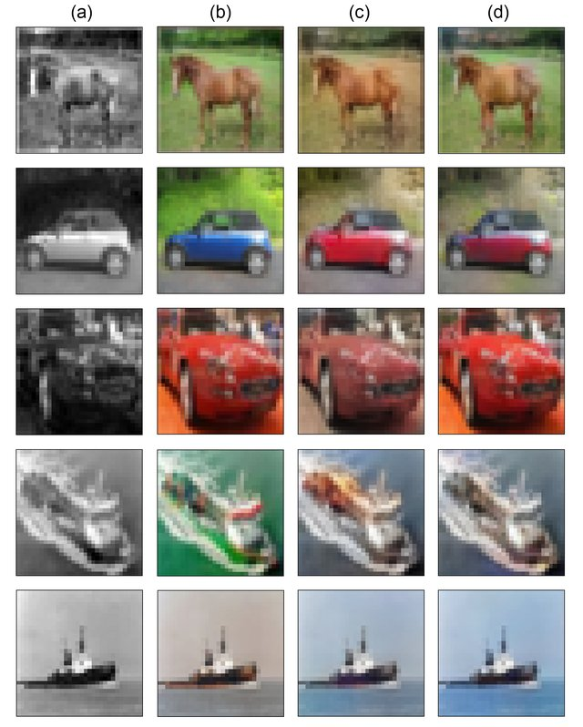

<h1 align="center">
  Image Colorization with Convolutional Neural Network
</h1>

<p align="center">
  Welcome to the <b>second</b> programming assignment of the Deep Learning course.

  
</p>


The goal of this assignment is to get you familiarized with **convolutional neural networks**. 
First, we will train a CNN model as our base model to solve the Image Colorization task as a pixel-wise classification problem. In general, Image Colorization is a difficult problem e.g. a grayscale image, may have several valid coloring images.

After training, we will add some configurations to it to check their effect and then analyze it.


**After this assignment you will be able to:**

 - Build and apply a Convolutional Neural Network to colorize grayscale images using the PyTorch framework.
 - See how factors like the **Batch normalization**, **Skip Connection**, ... affect the result of the learning process.
 - Be familiar with U-Net architecture.


 > **_NOTE:_** Alongside the `CNN.ipynb` notebook, there are some python files with the coding parts you need to implement are denoted by: ``` # YOUR CODE #```. Moreover, some <u>Questions</u> are given in the assignment file. 


## Dataset
 
**CIFAR-10** will be the dataset used in this assignment which consists of images of size 32x32 pixels. For simplicity,  one category of this dataset is considered (automobile).[link](https://www.cs.toronto.edu/~kriz/cifar.html)

For the Image Colorization task, this dataset will be needed some preprocessing that was already done for you that you can use to convert images to grayscale and the labels that show color classes for each pixel or vice versa. (implemented in `utils.py`)

The subset of **24 colors** that are selected to colorize the grayscale images is provided in the python file.


## What these codes do (exist in PY files)

There are four PY files that are required to run the CNN.ipynb. Below, the functionality of each PY file are summarized, but more details are provided in the files themselves.

- utils.py: Contain several functions for data preprocessing.
- torch_helper.py: Contain several functions used during the training process. `some of them required to implement`
- model.py: Contains several classes as the models and their blocks (base model and custom U-Net). `required to implement`
- train.py: as the its name show it is for training and validating model. `required to implement`

<br>

**Problem Statement:** You are given two dataset `train_signs.h5` and `test_signs.h5` containing:

    -- train different CNN models to classify each pixel of the image.

